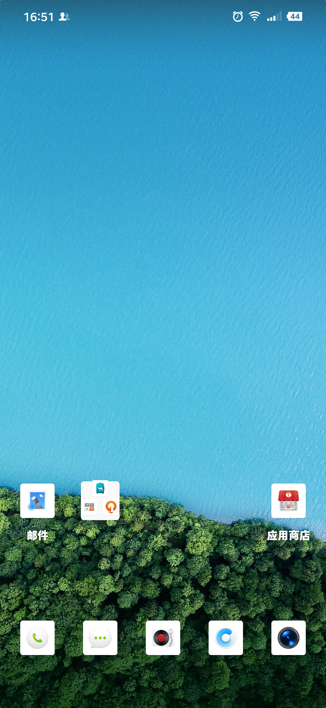
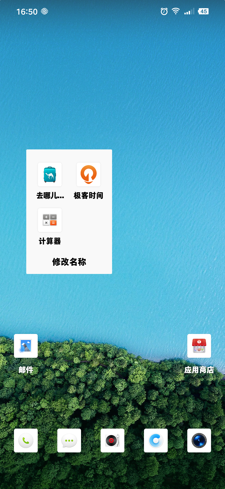
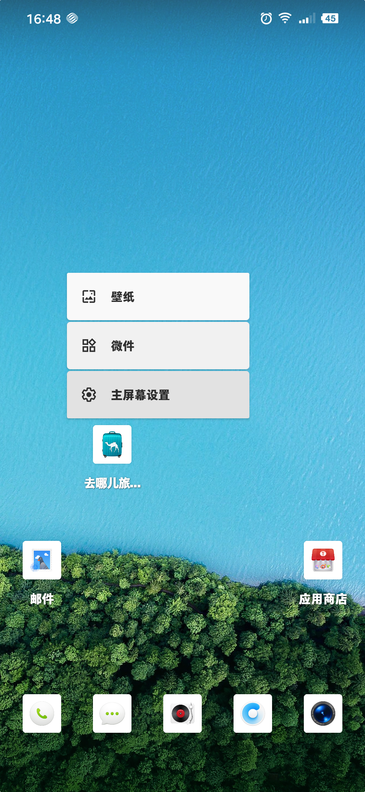
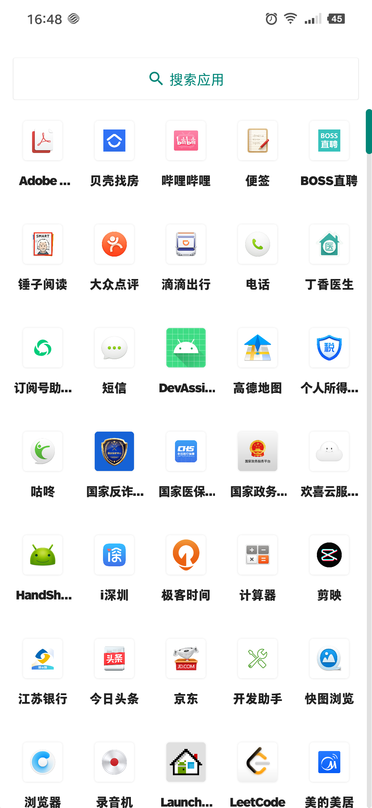
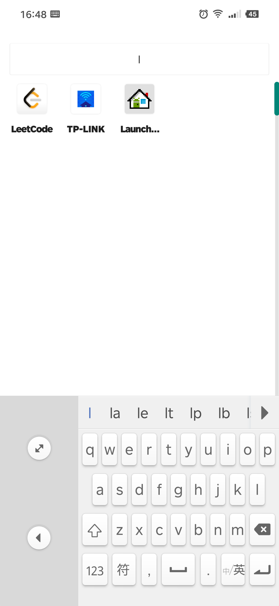
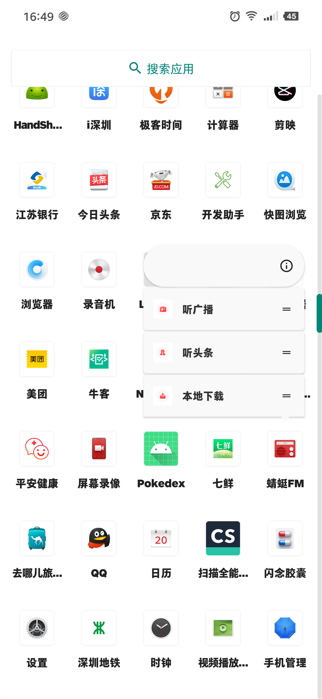
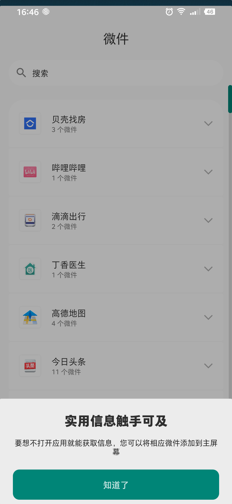
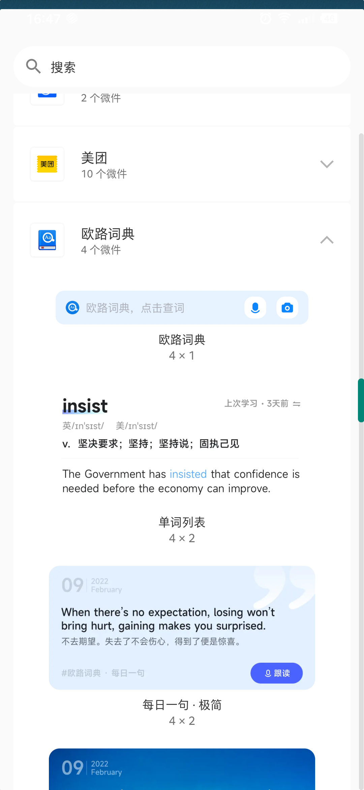
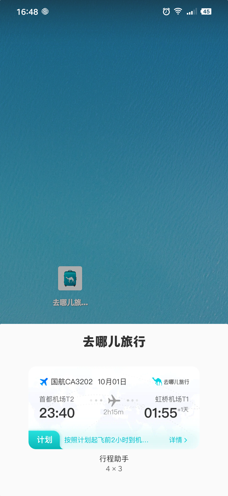
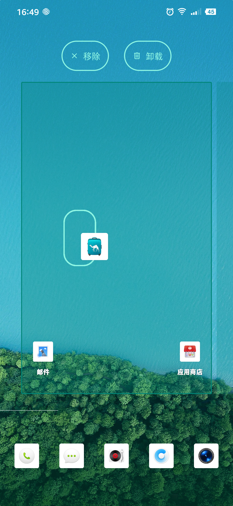

<h1 align="center">Launcher3</h1>

[toc]

## 更新：20220911

* Android-13 (Launcher-master-20220821(b62600b8c3de47a26386aa59f06959b2cf1af753)版本源码)

## 说明
目前只支持withoutQuickstep编译
如果因为Android studio或者Intellij Idea版本问题可以使用Intellij Idea 2022.1.2版本可以正常编译。

## 主要分支

* Main：(Launcher-master-20220821(b62600b8c3de47a26386aa59f06959b2cf1af753))--Android-13
* Dev：增加一些功能
* feature：开发特性需求

## 常见问题

[常见问题备注](REMARKS.md)

## 功能规划

| 功能    | 是否完成 | 备注  |
|-------|------|-----|
| 单双层切换 | 完成   |     |
| 循环滑动  | 未完成  |     |
| 滑动特效  | 未完成  |     |
| 负一屏   | 未完成  |     |
| 特效菜单  | 未完成  |     |
| 特效调优  | 未完成  |     |
| 切换主题  | 未完成  |     |
| 切换壁纸  | 未完成  |     |
| 切换托盘  | 未完成  |     |
| 搜索    | 未完成  |     |
| 最近应用  | 未完成  |     |

## 源码参考
https://cs.android.com/android/platform/superproject/+/master:packages/apps/Launcher3/

## 教程
注：本教程是基于Android6.0的Launcher3讲解的，最新版与现在版本差异较大，我尽量在关键位置添加相应的注释，方便大家修改。
#### 一.[墨香带你学Launcher之（一）-概述](http://www.codemx.cn/2016/07/30/Launcher01/)

#### 二.[墨香带你学Launcher之（二）-数据加载流程](http://www.codemx.cn/2016/08/05/Launcher02/)

#### 三.[墨香带你学Launcher之（三）-绑定屏幕、图标、文件夹和Widget](http://www.codemx.cn/2016/08/14/Launcher03/)

#### 四.[墨香带你学Launcher之（四）-应用安装、更新、卸载时的数据加载](http://www.codemx.cn/2016/08/21/Launcher04/)

#### 五.[墨香带你学Launcher之（五）-Workspace滑动](http://www.codemx.cn/2016/10/16/Launcher05/)

#### 六.[墨香带你学Launcher之（六）-拖拽](http://www.codemx.cn/2016/11/21/Launcher06/)

#### 七.[墨香带你学Launcher之（七）-小部件的加载、添加以及大小调节](http://www.codemx.cn/2016/12/18/Launcher07/)

#### 八.[墨香带你学Launcher之（八）- 加载Icon、设置壁纸](http://www.codemx.cn/2017/05/19/Launcher08/)

## Protobuf相关信息查看
* [Protobuf](https://github.com/protocolbuffers/protobuf)
* [protobuf-gradle-plugin](https://github.com/google/protobuf-gradle-plugin)

## 预览图
    
    
    
    
    
